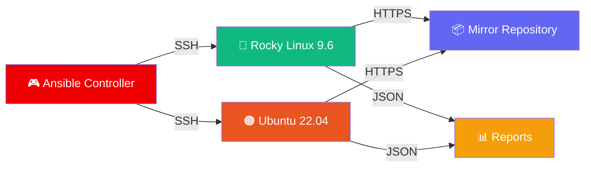

# 🐧 Linux Patching System

<div align="center">

[](https://www.ansible.com/)
[](https://rockylinux.org/)
[](https://ubuntu.com/)

**Automated • Auditable • Offline-Ready**

*A comprehensive Ansible-based patching solution for heterogeneous Linux environments*

[Features](#-features) • [Quick Start](#-quick-start) • [Documentation](#-documentation) • [Reports](#-reporting)

---

</div>

## 🌟 Features

<table>
<tr>
<td width="50%">

### 🎯 **Smart Patching**
- ✅ DNF-based patching for Rocky Linux
- ✅ APT-based patching for Ubuntu
- ✅ Automatic dependency resolution
- ✅ Kernel upgrade detection

</td>
<td width="50%">

### 🔒 **Secure & Reliable**
- 🔐 Offline mirror repositories
- 🔐 Site-specific SSH key management
- 🔐 Self-signed certificate support
- 🔐 Pre-flight connectivity checks

</td>
</tr>
<tr>
<td width="50%">

### 📊 **Comprehensive Reporting**
- 📈 JSON-formatted results
- 📈 Per-host patch status
- 📈 Package change tracking
- 📈 Reboot requirement detection

</td>
<td width="50%">

### 🛡️ **Error Handling**
- ⚡ Automatic retry logic
- ⚡ Graceful failure recovery
- ⚡ Detailed error messages
- ⚡ Rollback-ready backups

</td>
</tr>
</table>

---

## 🚀 Quick Start

### 📋 Prerequisites

```bash
# Required versions
Ansible:     2.18+
Python:      3.x
Target OS:   Rocky Linux 9.6 / Ubuntu 22.04
Disk Space:  2GB+ in /var
```

### ⚙️ Installation

```bash
# Clone the repository
git clone <your-repo-url>
cd linux-patching-system

# Verify Ansible installation
ansible --version

# Test connectivity
ansible all -m ping -i inventory.ini
```

### 🎮 Usage

<table>
<tr>
<td width="50%">

#### 🔴 **Rocky Linux**

```bash
# Patch all Rocky systems
ansible-playbook rocky_patch.yml \
  -i inventory.ini

# Patch specific host
ansible-playbook rocky_patch.yml \
  -i inventory.ini \
  --limit server01
```

</td>
<td width="50%">

#### 🟠 **Ubuntu**

```bash
# Patch all Ubuntu systems
ansible-playbook ubuntu_patch.yml \
  -i inventory.ini

# Patch specific site
ansible-playbook ubuntu_patch.yml \
  -i inventory.ini \
  --limit locations_brg
```

</td>
</tr>
</table>

---

## 🏗️ Architecture



---

## 📦 Repository Configuration

### 🔴 Rocky Linux Repositories

| Repository | Description | Purpose |
|:-----------|:------------|:--------|
| 📚 **baseos** | Core OS Packages | System fundamentals |
| 🎨 **appstream** | Applications | Extended software |
| 🛠️ **crb** | CodeReady Builder | Development tools |
| ⭐ **epel** | Extra Packages | Community software |
| 🎁 **extras** | Rocky Extras | Additional packages |
| 🏥 **highavailability** | HA Cluster | Clustering tools |
| 📊 **zabbix** | Monitoring Agent | System monitoring |
| 🔧 **zabbix-tools** | Zabbix Utilities | Management tools |

### 🟠 Ubuntu Sources

| Source | Components | Security Level |
|:-------|:-----------|:---------------|
| 📦 **jammy** | main, universe | ⭐⭐⭐ Standard |
| 🔄 **jammy-updates** | main, universe | ⭐⭐⭐⭐ Updates |
| 🔒 **jammy-security** | main, universe | ⭐⭐⭐⭐⭐ Critical |

---

## 🔄 Workflow

<details>
<summary><b>🔴 Rocky Linux Patching Workflow</b></summary>

```
┌─────────────────────────────────────────────────────────┐
│  1️⃣  PRE-FLIGHT CHECKS                                  │
│  ✓ Generate UTC timestamp                               │
│  ✓ Add mirror to /etc/hosts                            │
│  ✓ Verify HTTPS connectivity                           │
└─────────────────────────────────────────────────────────┘
                         ↓
┌─────────────────────────────────────────────────────────┐
│  2️⃣  REPOSITORY SETUP                                   │
│  ✓ Backup existing .repo files                         │
│  ✓ Create temporary offline configs                    │
│  ✓ Disable GPG & SSL verification                      │
└─────────────────────────────────────────────────────────┘
                         ↓
┌─────────────────────────────────────────────────────────┐
│  3️⃣  PACKAGE OPERATIONS                                 │
│  ✓ Validate /var disk space (2GB+)                     │
│  ✓ Clean & rebuild DNF cache                           │
│  ✓ Execute dnf upgrade --refresh                       │
│  ✓ Run dnf distro-sync                                 │
└─────────────────────────────────────────────────────────┘
                         ↓
┌─────────────────────────────────────────────────────────┐
│  4️⃣  POST-PATCH ANALYSIS                                │
│  ✓ Parse package change lists                          │
│  ✓ Detect kernel upgrades                              │
│  ✓ Check reboot requirements                           │
│  ✓ Calculate execution metrics                         │
└─────────────────────────────────────────────────────────┘
                         ↓
┌─────────────────────────────────────────────────────────┐
│  5️⃣  REPORTING                                           │
│  ✓ Generate JSON report                                │
│  ✓ Create latest.json symlink                          │
│  ✓ Set rundeck ownership                               │
└─────────────────────────────────────────────────────────┘
```

</details>

<details>
<summary><b>🟠 Ubuntu Patching Workflow</b></summary>

```
┌─────────────────────────────────────────────────────────┐
│  0️⃣  DYNAMIC HOST BUILDING                              │
│  ✓ Filter inventory (exclude mirror)                   │
│  ✓ Select site-specific SSH keys                       │
│  ✓ Build dynamic_hosts group                           │
└─────────────────────────────────────────────────────────┘
                         ↓
┌─────────────────────────────────────────────────────────┐
│  1️⃣  PRE-FLIGHT SETUP                                   │
│  ✓ Add mirror to /etc/hosts                            │
│  ✓ Verify HTTPS connectivity                           │
│  ✓ Seed official sources if missing                    │
└─────────────────────────────────────────────────────────┘
                         ↓
┌─────────────────────────────────────────────────────────┐
│  2️⃣  REPOSITORY CONFIGURATION                           │
│  ✓ Create _tmp-local-mirror.list                       │
│  ✓ Configure APT for self-signed cert                  │
│  ✓ Update cache (5 retries, 12s delay)                 │
└─────────────────────────────────────────────────────────┘
                         ↓
┌─────────────────────────────────────────────────────────┐
│  3️⃣  PACKAGE OPERATIONS                                 │
│  ✓ Validate /var disk space (2GB+)                     │
│  ✓ apt-get upgrade (with retry)                        │
│  ✓ apt-get dist-upgrade (critical)                     │
│  ✓ Fix broken dependencies                             │
└─────────────────────────────────────────────────────────┘
                         ↓
┌─────────────────────────────────────────────────────────┐
│  4️⃣  CLEANUP & ANALYSIS                                 │
│  ✓ Remove temporary configs                            │
│  ✓ Parse upgrade statistics                            │
│  ✓ Check /var/run/reboot-required                      │
│  ✓ Generate comprehensive report                       │
└─────────────────────────────────────────────────────────┘
```

</details>

---

## 📊 Patch States

<div align="center">

| State | Icon | Description |
|:------|:----:|:------------|
| **error** | ❌ | Patching failed with error |
| **updated** | ✅ | Packages upgraded successfully |
| **no_history** | ⚠️ | Upgraded but no history log |
| **no_change_patched** | ℹ️ | No upgrades, history exists |
| **no_change_no_history** | 🔵 | No changes detected |
| **unreported** | ❓ | State undetermined |

</div>

---

## 📈 Reporting

### 📁 Report Locations

```bash
# Rocky Linux
/usr/local/ansible/projects/rocky/logs/
├── master_run_2024-11-19_14:30:22_UTC.json
└── master_run.json → master_run_2024-11-19_14:30:22_UTC.json

# Ubuntu
/usr/local/ansible/projects/ubuntu/logs/
├── master_run_2024-11-19_15:45:30_UTC.json
└── master_run.json → master_run_2024-11-19_15:45:30_UTC.json
```

### 📄 Report Structure

```json
{
  "os": "Rocky Linux 9.6",
  "host": "server01.example.com",
  "patch_state": "updated",
  "uptime": "45 hours, 23 minutes, 12 seconds",
  "timestamp": "20241119T143022Z",
  "started_at": "2024-11-19T14:25:00Z",
  "finished_at": "2024-11-19T14:30:22Z",
  "exec_time_sec": 322,
  "kernel_before": "5.14.0-362.el9.x86_64",
  "kernel_after": "5.14.0-427.el9.x86_64",
  "kernel_changed": true,
  "reboot_needed": true,
  "reboot_reason": "kernel_upgraded",
  "upgrade_stats": {
    "upgraded": 87,
    "newly_installed": 5,
    "to_remove": 0,
    "not_upgraded": 3
  },
  "packages": {
    "upgraded": ["package1", "package2"],
    "linux_kernels": ["kernel-5.14.0-427.el9"]
  }
}
```

---

## 🛡️ Security

### ⚠️ Important Security Notes

<table>
<tr>
<td>

#### 🔓 SSL Verification Disabled

```yaml
# Rocky Linux
sslverify=0

# Ubuntu
Verify-Peer "false"
Verify-Host "false"
```

**⚠️ Production Recommendation:** Use properly signed certificates

</td>
<td>

#### 🔑 SSH Key Management

```bash
# Location-based keys
/usr/local/ansible/keys/
└── workstations/
    ├── ansible-brg-ubuntu-ecdsa
    ├── ansible-nyc-ubuntu-ecdsa
    └── ansible-lax-ubuntu-ecdsa

# Secure permissions
chmod 600 /usr/local/ansible/keys/workstations/*
```

</td>
</tr>
</table>

---

## 🔧 Troubleshooting

<details>
<summary><b>❌ Package Update Failures</b></summary>

**Rocky Linux:**
```bash
tail -100 /var/log/dnf.log
dnf history info last
```

**Ubuntu:**
```bash
tail -100 /var/log/apt/history.log
tail -100 /var/log/apt/term.log
```

</details>

<details>
<summary><b>💾 Disk Space Issues</b></summary>

```bash
# Check current usage
df -h /var

# Clean package cache
dnf clean all        # Rocky Linux
apt-get clean        # Ubuntu
apt-get autoclean    # Ubuntu
apt-get autoremove   # Ubuntu
```

</details>

<details>
<summary><b>🔑 SSH Authentication Failures</b></summary>

```bash
# Verify key exists
ls -la /usr/local/ansible/keys/workstations/

# Fix permissions
chmod 600 /usr/local/ansible/keys/workstations/ansible-*
chown ansible:ansible /usr/local/ansible/keys/workstations/ansible-*

# Test connection
ansible host -m ping -i inventory.ini
```

</details>

---

## ✅ Best Practices

<div align="center">

| # | Practice | Importance |
|:-:|:---------|:----------:|
| 1️⃣ | Test in non-production first | 🔴🔴🔴 Critical |
| 2️⃣ | Schedule during maintenance windows | 🔴🔴🔴 Critical |
| 3️⃣ | Monitor first run closely | 🔴🔴 High |
| 4️⃣ | Review JSON reports regularly | 🔴🔴 High |
| 5️⃣ | Coordinate reboots based on flags | 🔴🔴 High |
| 6️⃣ | Maintain mirror availability | 🔴 Medium |
| 7️⃣ | Archive reports for compliance | 🔴 Medium |
| 8️⃣ | Update SSH keys before expiry | 🔴 Medium |

</div>

---

## 🚀 Future Enhancements

### 🎯 Modular Architecture Roadmap

The current playbooks contain all logic in single monolithic files. Future iterations will implement a modular structure following Ansible best practices:

#### 🎁 Benefits

- ♻️ **Reusability** - Share roles across distros
- 🔧 **Maintainability** - Single responsibility per role
- 🧪 **Testing** - Independent role testing with Molecule
- 📖 **Readability** - Smaller, focused files
- 📝 **Version Control** - Track component changes
- 👥 **Collaboration** - Parallel development
- 🛡️ **Error Isolation** - Contained failure contexts

---

<div align="center">

## 💬 Support & Contributing

**Found a bug?** Open an issue
**Have a feature request?** Start a discussion
**Want to contribute?** Submit a pull request

---

### 📜 License

This project is licensed under the terms specified in the LICENSE file.

---

**Made with ❤️ by your DevOps team**

[](https://www.ansible.com/)
[](https://www.linux.org/)

</div>